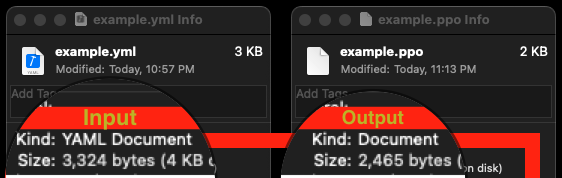

# Prompt Primer Reducer

This project houses a Python notebook aimed at reducing the size of GPT Primer files. The main approach is to remove all white space from the `primer` text, which enhances efficiency, reduces token usage, and results in more consistent outputs.

## Background

A GPT Primer file, often used with OpenAI's language model, is a YML file that consists of metadata used to influence, constrain, and contextualize ChatGPT responses. This notebook will help you create a reduced version of such files.

### About `.ppo` file type

The `.ppo` file type is an alternative to the `.yml` file type. It stores a reduced version of the input file with all white space removed from the `primer` text.

## Usage

1. Change the `primer_name` variable to the name of the file in the `/primers` directory that you want to reduce.
2. Run the notebook.

This will create a reduced file, which is stored in the `/reduced_primers` directory.

## Functionality

The notebook contains a function `get_primer()` that loads the primer file from a source directory. The function's default parameter is set to `'example'`, but you can pass any primer file name as an argument.

## Visual Proof

The notebook contains a visual proof of the file size reduction process.

