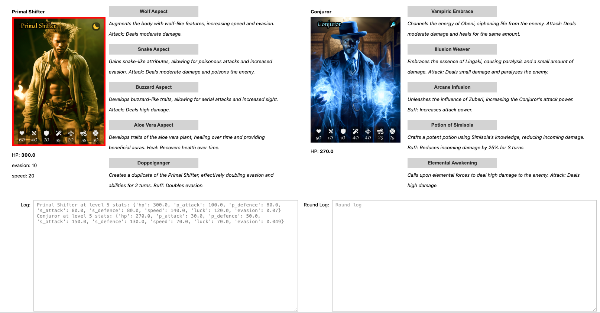
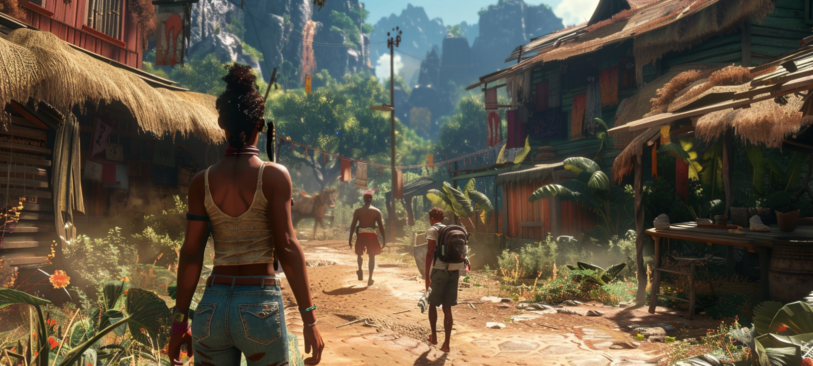

# Simulat33 (RPG Battle Simulation)

## Overview

This **Simulat33** draws inspiration from classic JRPG battle systems. The goal is to create an interactive and strategic 1v1 battle environment where characters from unique classes face off, utilizing a variety of skills and abilities.

> *The simulation is implemented within a Jupyter notebook, using `ipywidgets` for an engaging and interactive user interface.*

## Project Goals

- **Diverse Character Classes**: Each character class has distinct strengths, weaknesses, and a progression path, which includes a variety of skills that evolve as the character levels up.
- **Turn-Based Battle Mechanics**: Enable strategic decision-making through a turn-based system where characters take turns to perform actions like attacks, heals, and buffs.
- **Interactive User Interface**: Provide a GUI that allows users to manually select moves for each character during their respective turns and displays detailed battle logs.

## Battle Mechanics

### Character Classes

Characters belong to unique classes, each with its own set of attributes:
- **Name**: The character class name.
- **Description**: A brief overview of the character class.
- **Strengths and Weaknesses**: Highlights the advantages and disadvantages of the character class.
- **Inheritance**: Special abilities that provide strategic advantages. (*TODO*)
- **Stats**: Includes starting stats, progression stats (skills learned at different levels), and final stats.

### Skills and Abilities

Each character class has a set of skills that evolve as the character levels up:
- **Skills**: Each skill has a creative description and a set of effects, which can include:
  - **Attacks**: Physical or spiritual attacks that deal damage to the opponent.
  - **Heals**: Abilities that restore health to the character.
  - **Buffs**: Temporary enhancements to the character’s stats, such as increased attack power or evasion.
  - **Debuffs**: Temporary reductions to the opponent’s stats.

### Turn-Based System

The battle follows a classic turn-based system:
- **Turn Order**: Characters take turns to select and execute skills. The turn order is managed by the system, ensuring that each character gets a chance to act. Turn order is probability-based and influenced by the 'speed' attribute of each character.
- **Move Selection**: During their turn, a character can choose from their available skills. The selected skill is then executed, applying its effects to the target.

### Battle Management

Several key elements are tracked and managed throughout the battle:
- **Health Points (HP)**: The current and maximum HP of each character. When a character’s HP reaches zero, they are defeated.
- **Buffs and Debuffs**: Temporary stat changes that last for a set number of rounds. Buffs can enhance a character’s stats, while debuffs reduce the opponent’s stats.
- **Status Effects**: Conditions such as poison or paralysis that affect a character over multiple rounds. These effects are tracked and updated each round.
- **Battle Log**: A detailed log of each action taken during the battle, including damage dealt, healing received, buffs applied, and status effects triggered. This log helps track the flow of the battle and provides insight into each round’s outcome.

### Tracking Across Rounds

Throughout the battle, the following elements are continuously tracked and updated:
- **Current Stats**: The real-time stats of each character, which can be modified by buffs, debuffs, and status effects.
- **Timers**: Each buff, debuff, and status effect has a timer indicating the number of rounds it will last. These timers are decremented at the end of each round.
- **Round Summary**: At the end of each round, a summary is generated, detailing the actions taken, the results of those actions, and the current state of each character.

## Interactive User Interface

The user interface provides an engaging way to manage the battle:
- **Move Selection**: Users can manually select moves for each character during their turn. Buttons corresponding to each skill are displayed, along with their descriptions.
- **Battle Display**: The interface shows the current status of both characters, including their HP, active buffs, and status effects.
- **Logs**: Two logs are displayed side-by-side:
  - **Round Log**: Provides a summary of the current round, including the actions taken and their results.
  - **Battle Log**: A continuous log of the entire battle, showing each round’s actions and outcomes in sequence.

