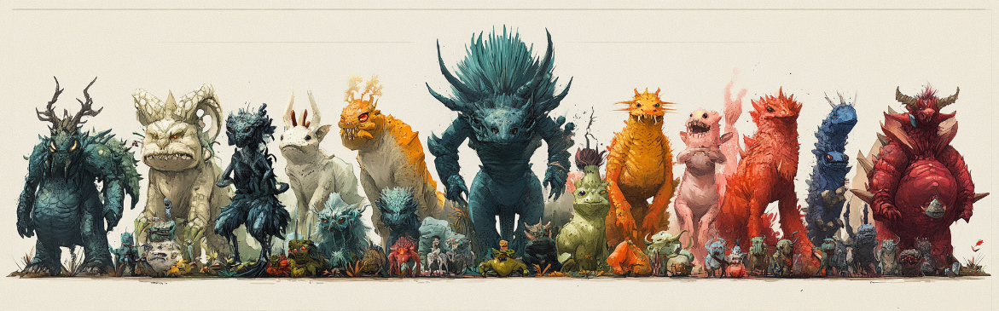

# Ancestral Stat Tree Visualization and Comparison

This Jupyter Notebook creates an interactive web application using Dash to visualize and compare nodes within an ancestral tree. Each node in the tree represents a "character" with unique stats, and the tree is generated based on a specific branching pattern. The app provides the following functionality:

1. **Tree Visualization**: 
   - A hierarchical graph displays the structure of the ancestral tree, with each node color-coded by its generation or stat distribution.
   - Clicking on a node displays detailed stats in radar charts below.

2. **Single-Node and Immediate Children Radar Charts**: 
   - When a node in the tree is selected, a radar chart visualizes that node's stats across various attributes like Health, PAttack, PDefense, MAttack, MDefense, and Speed.
   - An adjacent radar chart displays a comparison of stats for the selected node's immediate children, allowing for quick insights into generational changes.

3. **Multi-Node Comparison**: 
   - Users can select up to 6 nodes from any generation for a side-by-side stat comparison in a radar chart. This enables visual comparison of multiple nodes and highlights the diversity in stat distribution across generations.
   - A summary section shows the total stats for each selected node to facilitate comparison.

## Key Components and Features

- **Dynamic Stat Generation**: Stats for each node are generated using a customizable branching pattern and unique distributions (balanced, extreme, mixed), creating varied and realistic character profiles.
- **Interactive Dropdowns**: Provides an intuitive interface for selecting nodes for comparison, with dropdown menus that list available nodes by generation.
- **Customizable Layout**: A structured, organized layout with sections for tree visualization, single-node and children comparisons, and multi-node comparisons.

## Technical Details

- **Dash for Interactivity**: The app uses Dash for interactivity, allowing users to click, select, and compare nodes dynamically.
- **Plotly for Visualization**: Graphs and radar charts are rendered using Plotly, which provides customizable and visually appealing plots.
- **NetworkX for Tree Structure**: The ancestral tree is structured as a directed graph using NetworkX, enabling flexible branching and hierarchical positioning.
